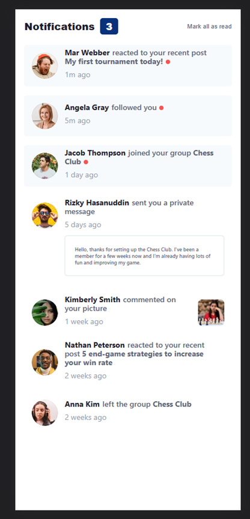
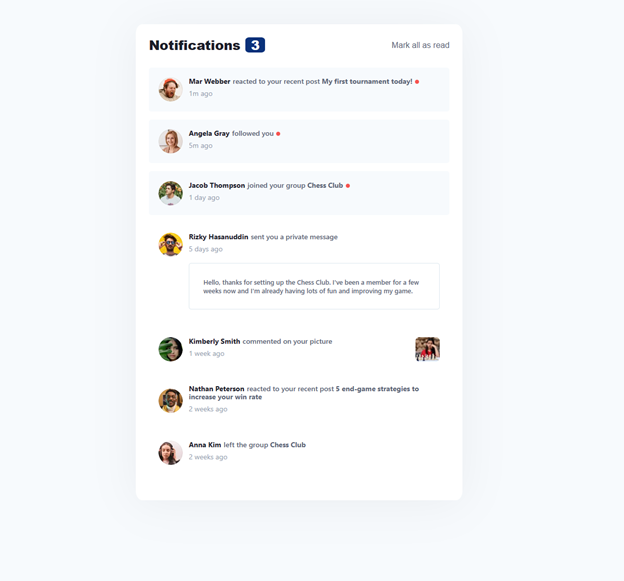

# Frontend Mentor - Notifications page solution

This is a solution to the [Notifications page challenge on Frontend Mentor](https://www.frontendmentor.io/challenges/notifications-page-DqK5QAmKbC). Frontend Mentor challenges help you improve your coding skills by building realistic projects.

## Table of contents

- [Overview](#overview)
  - [The challenge](#the-challenge)
  - [Screenshot](#screenshot)
  - [Links](#links)
- [My process](#my-process)
  - [Built with](#built-with)
  - [What I learned](#what-i-learned)
  - [Useful resources](#useful-resources)
- [Author](#author)


## Overview

### The challenge

Users should be able to:

- Distinguish between "unread" and "read" notifications
- Select "Mark all as read" to toggle the visual state of the unread notifications and set the number of unread messages to zero
- View the optimal layout for the interface depending on their device's screen size
- See hover and focus states for all interactive elements on the page

### Screenshot





### Links

- Solution URL: [click here](https://www.frontendmentor.io/solutions/notifications-page-6PVuOOvRx0)
- Live Site URL: [click here](https://urealaden.github.io/notification-component/)

## My process

### Built with

- Semantic HTML5 markup
- CSS custom properties
- Flexbox
- CSS Grid
- Mobile-first workflow
- [React](https://reactjs.org/) - JS library
- [Fluent UI](https://developer.microsoft.com/en-us/fluentui#/controls/web) - Cross Platform UX framework

### What I learned

I decided to continue playing around with Fluent UI and Typescript. In particular manipulating the Persona attributes. Styling the individual elements was a bit tedius with typescript
To see how you can add code snippets, see below:

```js
<Persona
  imageUrl={user.imageUrl}
  size={PersonaSize.size48}
  showSecondaryText={true}
  secondaryText={user.timeSpan}
  onRenderPrimaryText={() => {
    return (
      <div className={styles.primaryTextContainer}>
        <div className={styles.primaryText}>
          {userAction[0]}
          <span className={styles.primaryTextAction}>{userAction[1]}</span>
          {user.action !== NotificationAction.MESSAGE &&
            user.action !== NotificationAction.COMMENT && (
              <span className={getUserTargetClass(user.action)}>
                {userAction[2]}
                <span
                  className={user.isRead ? styles.readBubble : styles.newBubble}
                ></span>
              </span>
            )}
        </div>
      </div>
    );
  }}
  styles={{
    secondaryText: styles.secondaryText,
    primaryText: styles.primaryText,
  }}
/>
```

### Useful resources

- [Persona Docs](https://developer.microsoft.com/en-us/fluentui#/controls/web/persona) 

## Author

- Website - [Leaundrae Mckinney](https://www.linkedin.com/in/leaundrae-mckinney/)
- Frontend Mentor - [@UreaLaden](https://www.frontendmentor.io/profile/UreaLaden)